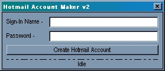



## Hotmail Account Maker

### Description

Want to make hotmail accounts on the fly? Well, this is the program, and source, for you! If you need any help, or have and questions, e-mail me at 'todaysforecast@yahoo.com'. If you find any bugs, or fixed anything, feel free to email me. I made this with Microsoft Visual Basic 6.0, and used msinet.ocx. Tested on Microsoft Internet Explorer 5.5. Thank-you for trying my program, and using my source code. If you make anything out of this, could ya please mention me somewhere? Hehe, thanks a lot.
 
### More Info
 
There are currently NO side effects

             |
---                |---
**Submitted On**   |2001-02-18 18:59:24
**By**             |[doleary86](https://github.com/Planet-Source-Code/PSCIndex/blob/master/ByAuthor/doleary86.md)
**Level**          |Beginner
**User Rating**    |5.0 (35 globes from 7 users)
**Compatibility**  |VB 6\.0
**Category**       |[Internet/ HTML](https://github.com/Planet-Source-Code/PSCIndex/blob/master/ByCategory/internet-html__1-34.md)
**World**          |[Visual Basic](https://github.com/Planet-Source-Code/PSCIndex/blob/master/ByWorld/visual-basic.md)
**Archive File**   |[CODE\_UPLOAD151692182001\.zip](https://github.com/Planet-Source-Code/doleary86-hotmail-account-maker__1-21135/archive/master.zip)

